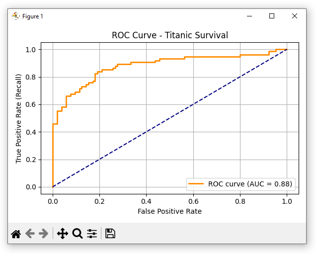
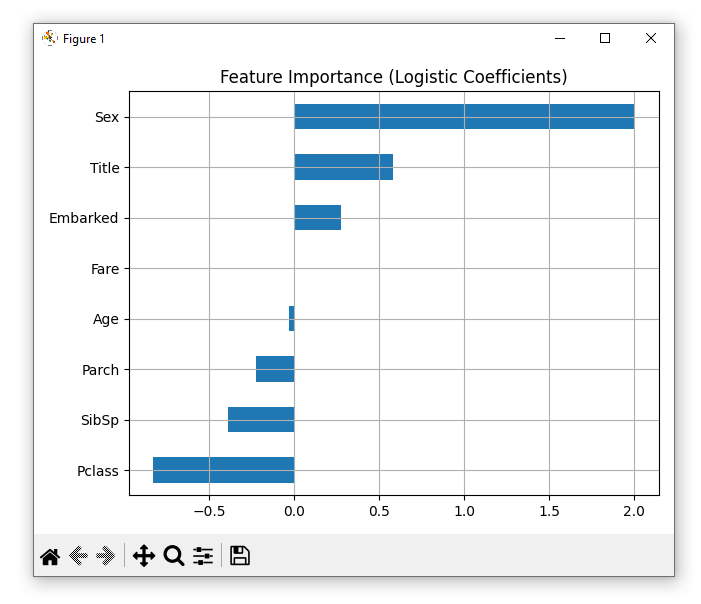

# 📊 Day 18 - Logistic Regression & Classification Metrics

Welcome to **Day 18** of your AI-90Days journey! Today, we move from predicting **continuous values** (like house prices) to **categorical outcomes** (like pass/fail or survive/die).

You’ll learn what **Logistic Regression** is, how it works, and how to apply it using **Scikit-learn**. We'll also explore how to evaluate a classification model using **accuracy**, **precision**, **recall**, and **confusion matrix**. Finally, you'll build a **mini-project** to predict survival on the Titanic.

---

## 🌟 Objectives

* Understand what **Logistic Regression** is and how it works
* Learn evaluation metrics: **Accuracy**, **Precision**, **Recall**, **F1-score**, and **Confusion Matrix**
* Train a classification model using `scikit-learn`
* Build a mini-project: **Predict Titanic survival** using Logistic Regression

---

## 🔍 What is Logistic Regression?

Logistic Regression doesn't draw a straight line like Linear Regression. Instead, it draws an **S-shaped curve** (called a **sigmoid** or **logistic function**) that helps in classifying data into **two categories** (e.g. Yes/No, 0/1, Pass/Fail, etc.).

For example:

> Will a person buy a product or not? (Yes = 1, No = 0)  
> Is the email spam or not? (Spam = 1, Not Spam = 0)

This curve maps any input number (like age, test score, income) into a value between **0 and 1**, which can be interpreted as a **probability**.

Think of it like this:

- The **input feature** can range from low to high values (e.g., exam score from 0 to 100).
- As the input increases, the **probability** of a "Yes" (or class 1) increases.
- The **threshold** is usually set at **0.5**.  
  - If predicted probability ≥ 0.5 → predict class **1** (Yes)
  - If predicted probability < 0.5 → predict class **0** (No)

Here is a simple ASCII diagram to visualize this:

```
      ^
  1.0 |                       o
      |                     o
      |                   o
      |                 o
  0.5 |-------------o------------->
      |          o
      |       o
      |    o
  0.0 |
         ←--- Input Feature Range ---→

    Above 0.5 → Class 1 (Yes)
    Below 0.5 → Class 0 (No)
```
---

### 🧠 Real-Life Analogy

Imagine you're trying to **predict whether a student will pass an exam** based on the number of study hours.

- If a student studies **0 hours**, the model gives a probability close to **0** → likely **fail**.
- If a student studies **5 hours**, the probability increases to around **0.5** → uncertain.
- If a student studies **10+ hours**, the probability becomes close to **1** → likely **pass**.

It won't tell you the exact score but will say: *"There's a 78% chance this student will pass."* This is how the **sigmoid function** helps make a yes/no decision based on numeric input.

---

## 📈 The Sigmoid Function

Instead of drawing a **straight line** like Linear Regression, Logistic Regression uses a **curve (S-shape)** called the Sigmoid Function. The **sigmoid** or **logistic** function convert any number into a range between **0 and 1**.

### 🧮 Formula:

```python
sigmoid(z) = 1 / (1 + e^(-z))
```

Where:

* `z` is the output of a linear equation like `z = aX + b`
* `e` is the Euler’s number (\~2.718)

This means no matter how big or small `z` is, the output will always be between 0 and 1.

* If `z` is a large positive number → sigmoid gives output close to 1
* If `z` is a large negative number → sigmoid gives output close to 0
* So, it maps any number to a probability between **0 and 1**


---

## 🏫 Simple Example - Predicting Pass/Fail

Let’s start with a very simple dataset: hours studied and attendance percentage.

```python
import pandas as pd
from sklearn.linear_model import LogisticRegression
from sklearn.model_selection import train_test_split
from sklearn.metrics import accuracy_score, confusion_matrix, classification_report

# Step 1: Sample Data
students = pd.DataFrame({
    "Study_Hours": [2, 4, 5, 6, 8, 9, 10, 11],
    "Attendance": [40, 50, 52, 60, 85, 87, 90, 95],
    "Passed":     [0, 0, 0, 0, 1, 1, 1, 1]
})

# Step 2: Split Features and Target
X = students[["Study_Hours", "Attendance"]]
y = students["Passed"]

# Step 3: Train/Test Split
X_train, X_test, y_train, y_test = train_test_split(X, y, test_size=0.25, random_state=0)

# Step 4: Train Logistic Regression
model = LogisticRegression()
model.fit(X_train, y_train)

# Step 5: Predictions
predictions = model.predict(X_test)

# Step 6: Evaluate
print("Accuracy:", accuracy_score(y_test, predictions))
print("Confusion Matrix:\n", confusion_matrix(y_test, predictions))
print("\nClassification Report:\n", classification_report(y_test, predictions))
```

### ✅ Explanation:

* The model learns from `Study_Hours` and `Attendance`.
* The target is binary: `Passed` → 1 or 0.
* It predicts whether a student will pass or fail.
* We use **accuracy**, **confusion matrix**, and **classification report** to evaluate.

---

## 📊 Understanding Classification Metrics

**Classification Metrics** are tools used **to evaluate how well a classification model is performing**. When you use models like **Logistic Regression**, **Decision Trees**, or **Random Forests** to classify something (like spam vs. not spam, disease vs. no disease), you need a way to check how good those predictions are.

Let's say you're building a model to predict whether an email is **spam** or **not spam**:

- If your model predicts *spam** when it's actually **spam**,  that's **great**!
- But if your model predicts **not spam**, and the email turns out to be **spam**, that's **bad** (you missed it).
- What if your model wrongly calls a **good email spam**? That's also bad, you blocked a useful message.

Classification metrics help you quantify all these outcomes.

---

### 📦 Confusion Matrix (The Base of Everything)

Most classification metrics are derived from a **Confusion Matrix**, which compares actual values with predicted values.

|                 | Predicted: Yes | Predicted: No  |
| --------------- | -------------- | -------------- |
| **Actual: Yes** | True Positive  | False Negative |
| **Actual: No**  | False Positive | True Negative  |

Let's break these down:

- **True Positive (TP)**: Model predicted Yes, and it was actually Yes.
- **True Negative (TN)**: Model predicted No, and it was actually No.
- **False Positive (FP)**: Model predicted Yes, but it was No (a "false alarm").
- **False Negative (FN)**: Model predicted No, but it was Yes (a "miss").

**Real-life Example:**

* Predicting a person has cancer when they don’t (FP) causes **panic**.
* Predicting a person is healthy when they actually have cancer (FN) can be **life-threatening**.

So, understanding these values is **critical** depending on the application.

---

### 📌 Accuracy - "How Often Am I Right?"

**Accuracy** tells you how many total predictions the model got correct, out of all the predictions it made. It measures the overall correctness of the model.

```text
Accuracy = (TP + TN) / (TP + TN + FP + FN)
```

**Real-life Example:**

Imagine you're a student grading a test with **100 questions**. You got **90 answers right**, and **10 wrong**. So your accuracy is:

```text
Accuracy = 90 / 100 = 90%
```

Pretty good, right?

**⚠️ But here's the catch:**

Suppose you're trying to detect **fraudulent transactions**. Out of 1000 transactions:

- 950 are **not fraud** (normal)
- 50 are **fraudulent**

Your model predicts **everything is not fraud*, it says none are fraud.

- ✅ It got 950 right (True Negatives)
- ❌ But it missed all 50 frauds (False Negatives)

So:

```text
Accuracy = 950 / 1000 = 95%
```

Still sounds good, **but it didn't catch a single fraud**!

- So, **Accuracy can be misleading** when one class (like "not fraud") dominates the dataset.
- Use accuracy when the dataset is **balanced** (equal 0s and 1s).

---

### 📌 Precision - "How Many of My Positive Predictions Were Actually Right?"

**Precision** focuses on the predictions the model made for the **positive class** (e.g., "Yes", "Spam", "Cancer"). It tells you: Of all the times I said "Yes", how many were actually Yes?

Out of all the predictions that were **positive**, how many were **actually positive**?

```text
Precision = TP / (TP + FP)
```

**Real-life Example:**

Imagine you're a **doctor testing for cancer**. You tested 10 people and said **5 have cancer**:

- Out of those 5, **only 2 actually had cancer**.
- The other 3 were wrongly diagnosed.

Then:

```text
Precision = 2 / (2 + 3) = 2 / 5 = 40%
```

That's low precision. When to care about Precision:

- When **false positives are harmful** or **costly**.
- You don’t want to tell someone they have cancer when they actually don't, it causes stress, unnecessary tests, and costs.

---

### 📌 Recall - "How Many Real Positives Did I Catch?"

**Recall** tells you that out of all the **actual positive cases**, how many did the model **correctly predict** as positive?

```text
Recall = TP / (TP + FN)
```
**Real-life Example:**

Same cancer testing example. Suppose 5 people **actually have cancer**, but your model **only finds 2 of them**:

```text
Recall = 2 / (2 + 3) = 2 / 5 = 40%
```

This means your model **missed 60% of the cancer patients**, which is dangerous! When to care about Recall:

- When **false negatives are more dangerous**.
- You don't want to miss people who actually have a disease even if it means occasionally testing someone who's fine.

We want **high recall** so no actual cases are missed.

---

### 📌 F1 Score - "The Balanced Metric"

F1 Score is the **harmonic mean** of **precision** and **recall**. It gives you a single number that balances both metrics.

```text
F1 = 2 * (Precision * Recall) / (Precision + Recall)
```

**Real-life Example:**

If your model has:

- Precision = 80%
- Recall = 40%

Then:

```text
F1 Score = 2 * (0.8 * 0.4) / (0.8 + 0.4) = 0.533
```

So even though precision was high, **low recall pulled the F1 down**. When to care about F1 Score:

- When both **false positives and false negatives are costly**.
- Ideal for **imbalanced datasets** (like fraud detection, rare disease detection).

A high F1 score means the model is doing well in **both** identifying positives correctly and not mislabeling negatives.

---

### 📈 ROC Curve & AUC - "How Good Are My Probabilities?"

#### 🔍 What is the ROC Curve?

**ROC** stands for **Receiver Operating Characteristic**. It's a graph that helps us evaluate how well a binary classifier (like Logistic Regression) is separating two classes, such as:

- Spam vs Not Spam
- Fraud vs Legit Transaction

It shows the relationship between:

- **True Positive Rate (TPR)** ➜ Of all real survivors, how many did we correctly catch?
- **False Positive Rate (FPR)** ➜ Of all who didn’t survive, how many did we wrongly think did?

Your model doesn't just say **"Yes"** or **"No"**, it gives a **probability** (e.g., 0.62 = 62% chance of survival).
You then decide a **threshold** (like 0.5) to convert this probability into Yes/No.

- If **probability >= 0.5** ➜ Predict **"Survived"**
- If **probability < 0.5** ➜ Predict **"Did Not Survive"**

Now imagine adjusting that threshold:

| Threshold | Behavior      | Effect                                                                                  |
| --------- | ------------- | --------------------------------------------------------------------------------------- |
| **0.9**   | Very strict   | Only very high scores become "Yes" ➜ Fewer false positives, but may miss real positives |
| **0.5**   | Default level | Balanced trade-off                                                                      |
| **0.3**   | Very lenient  | More predicted "Yes", may catch more real ones but also include false alarms            |

At each threshold, we calculate:

- **True Positive Rate (TPR)** = TP / (TP + FN)
- **False Positive Rate (FPR)** = FP / (FP + TN)

We then plot **TPR vs FPR** at multiple thresholds ➜ This is the ROC curve!

---

#### 🧮 What is AUC?

**AUC** stands for **Area Under the Curve**, it is a single number summary of the ROC curve. Its range is **0.0** to **1.0**

| AUC Value | What It Means             |
| --------- | ------------------------- |
| **1.0**   | Perfect classifier        |
| **0.9**   | Excellent                 |
| **0.8**   | Good                      |
| **0.7**   | Fair                      |
| **0.6**   | Poor                      |
| **0.5**   | Useless (random guessing) |
| **< 0.5** | Worse than guessing! 😬   |

**Real-life Example:**

Imagine you're a security guard watching people enter a mall. You have a camera AI system that gives a **suspicion score** (0 to 1) for each person.

You must decide at what score to **raise the alarm**.

| Threshold | Action Taken                            | Outcome                                                       |
| --------- | --------------------------------------- | ------------------------------------------------------------- |
| 0.9       | Alarm for very suspicious behavior only | You catch few actual threats but miss some. Low FPR, low TPR. |
| 0.5       | Alarm if moderately suspicious          | Balanced approach — catch more threats, a few false alarms    |
| 0.2       | Alarm easily triggered                  | You catch all possible threats, but too many false alarms     |

As you adjust your **threshold**, your **true positive rate** (caught real threats) and **false positive rate** (false alarms) change.
By plotting all these changes, you draw your **ROC Curve**.

A better system will give a **high AUC** (close to 1), showing it's smart at separating real threats from false alarms.

---

#### 📌 Key Takeaways

- ROC curve **doesn't care about exact thresholds**, it shows overall performance.
- AUC gives you a **single score** for your model's **discrimination power**.
- **High AUC** model does a great job at ranking positive examples above negative ones.

---

## 🚢 Mini Project - Predicting Titanic Survival

We'll use the **Titanic dataset** and apply **Logistic Regression** to predict whether a passenger survived or not.

Along the way, we'll calculate and **explain each classification metric**:

- Accuracy
- Precision
- Recall
- F1 Score
- Confusion Matrix
- ROC Curve
- AUC

Let's use a real-world dataset: the Titanic dataset from Kaggle.

```python
import pandas as pd
import numpy as np
import matplotlib.pyplot as plt
from sklearn.model_selection import train_test_split
from sklearn.linear_model import LogisticRegression
from sklearn.metrics import (
    accuracy_score, confusion_matrix, classification_report,
    precision_score, recall_score, f1_score, roc_curve, auc
)

# Step 1: Load Dataset
url = "https://raw.githubusercontent.com/datasciencedojo/datasets/master/titanic.csv"
titanic = pd.read_csv(url)

# Step 2: Select Features and Clean
features = titanic[["Pclass", "Sex", "Age", "SibSp", "Parch", "Fare"]]
features["Sex"] = features["Sex"].map({"male": 0, "female": 1})  # Convert to numeric
features["Age"] = features["Age"].fillna(features["Age"].median())  # Fill missing age

X = features
y = titanic["Survived"]

# Step 3: Train-Test Split
X_train, X_test, y_train, y_test = train_test_split(
    X, y, test_size=0.2, random_state=42
)

# Step 4: Train Logistic Regression Model
model = LogisticRegression(max_iter=200)
model.fit(X_train, y_train)

# Step 5: Make Predictions
y_pred = model.predict(X_test)
y_probs = model.predict_proba(X_test)[:, 1]  # Probability of class 1 (survived)

# Step 6: Evaluation Metrics
accuracy = accuracy_score(y_test, y_pred)
precision = precision_score(y_test, y_pred)
recall = recall_score(y_test, y_pred)
f1 = f1_score(y_test, y_pred)
conf_matrix = confusion_matrix(y_test, y_pred)

print("Accuracy:", round(accuracy, 3))
print("Precision:", round(precision, 3))
print("Recall:", round(recall, 3))
print("F1 Score:", round(f1, 3))
print("\nConfusion Matrix:\n", conf_matrix)

# Step 7: ROC Curve and AUC
fpr, tpr, thresholds = roc_curve(y_test, y_probs)
roc_auc = auc(fpr, tpr)
print("AUC Score:", round(roc_auc, 3))

# Plot ROC Curve
plt.figure(figsize=(6, 4))
plt.plot(fpr, tpr, color='darkorange', lw=2, label=f"ROC curve (AUC = {roc_auc:.2f})")
plt.plot([0, 1], [0, 1], color='navy', linestyle='--')
plt.xlabel("False Positive Rate")
plt.ylabel("True Positive Rate (Recall)")
plt.title("ROC Curve - Titanic Survival")
plt.legend(loc="lower right")
plt.grid(True)
plt.tight_layout()
plt.show()
```

After running the logistic regression model, here's what each **metric** in the output and **graph** tells us about the model's performance:

```text
Accuracy: 0.81
Precision: 0.803
Recall: 0.716
F1 Score: 0.757

Confusion Matrix:
[[93 10]
 [21 53]]

AUC Score: 0.88
```

#### 📌 Accuracy: 0.81

> 81% of all predictions were correct. 

Useful when both classes (Survived / Not Survived) are fairly balanced.

#### 🎯 Precision: 0.803

> Out of all passengers **predicted as Survived**, 80.3% actually survived.

Important when **false positives** are costly (e.g., predicting survival when they didn’t).

#### 🔍 Recall (Sensitivity): 0.716

> Out of all actual survivors, **71.6% were correctly identified**.

Important when **missing a real case** is risky (e.g., medical cases, rescue).

#### ⚖️ F1 Score: 0.757

> A balance between **Precision** and **Recall** - useful when classes are imbalanced.

#### 📦 Confusion Matrix:

```text
[[93 10]
 [21 53]]
```
This 2x2 table summarizes how well the model performed:

|                | Predicted No | Predicted Yes |
| -------------- | ------------ | ------------- |
| **Actual No**  | 93           | 10            |
| **Actual Yes** | 21           | 53            |


- ✅ 93: Correctly predicted "Did Not Survive" (True Negatives)
- ✅ 53: Correctly predicted "Survived" (True Positives)
- ❌ 10: Predicted “Survived” but didn’t (False Positives)
- ❌ 21: Missed real survivors (False Negatives)

#### 📈 ROC Curve & AUC: 0.88



- ROC Curve shows how the **True Positive Rate** vs. **False Positive Rate** varies with thresholds.
- **AUC** (Area Under Curve) = `0.88` → The model has **very good** discrimination power.

---

## 🧪 Practice Exercise

Let's **modify the Titanic dataset** in several ways to deepen your understanding of feature selection, train/test splits, and probability predictions.

---

### 🔁 Step-by-Step Modified Version

We'll:

- Add new features like `Embarked` and `Name`.
- Drop features like `Cabin` (high missingness).
- Try different `test_size` values.
- Use `model.predict_proba()` to explore survival probabilities.

---

### ✅ Updated Titanic Model - With Extra Features and Comparisons

```python
import pandas as pd
import numpy as np
import matplotlib.pyplot as plt
from sklearn.model_selection import train_test_split
from sklearn.linear_model import LogisticRegression
from sklearn.metrics import (
    accuracy_score, confusion_matrix, classification_report,
    precision_score, recall_score, f1_score, roc_curve, auc
)

# Step 1: Load Dataset
url = "https://raw.githubusercontent.com/datasciencedojo/datasets/master/titanic.csv"
titanic = pd.read_csv(url)

# Step 2: Feature Engineering
# Create a new column: Title extracted from Name (Mr, Mrs, Miss, etc.)
titanic["Title"] = titanic["Name"].str.extract(r" ([A-Za-z]+)\.", expand=False)

# Simplify rare titles
rare_titles = titanic["Title"].value_counts()[titanic["Title"].value_counts() < 10].index
titanic["Title"] = titanic["Title"].replace(rare_titles, "Rare")

# Fill missing Embarked with most common
titanic["Embarked"] = titanic["Embarked"].fillna(titanic["Embarked"].mode()[0])

# Drop Cabin and Ticket (too many missing values or non-numeric)
titanic = titanic.drop(columns=["Cabin", "Ticket", "Name", "PassengerId"])

# Encode categorical features
titanic["Sex"] = titanic["Sex"].map({"male": 0, "female": 1})
titanic["Embarked"] = titanic["Embarked"].map({"S": 0, "C": 1, "Q": 2})
titanic["Title"] = titanic["Title"].map({
    "Mr": 0, "Miss": 1, "Mrs": 2, "Master": 3, "Rare": 4
})

# Fill missing Age
titanic["Age"] = titanic["Age"].fillna(titanic["Age"].median())

# Select Features
features = ["Pclass", "Sex", "Age", "SibSp", "Parch", "Fare", "Embarked", "Title"]
X = titanic[features]
y = titanic["Survived"]
```

---

### 🔄 Try Multiple Train-Test Split Sizes

```python
for test_size in [0.1, 0.2, 0.3]:
    print(f"\nTest Size: {test_size}")
    
    # Split Data
    X_train, X_test, y_train, y_test = train_test_split(X, y, test_size=test_size, random_state=42)
    
    # Train Model
    model = LogisticRegression(max_iter=200)
    model.fit(X_train, y_train)
    
    # Predict
    y_pred = model.predict(X_test)
    y_probs = model.predict_proba(X_test)[:, 1]
    
    # Evaluate
    accuracy = accuracy_score(y_test, y_pred)
    precision = precision_score(y_test, y_pred)
    recall = recall_score(y_test, y_pred)
    f1 = f1_score(y_test, y_pred)
    roc_auc = auc(*roc_curve(y_test, y_probs)[:2])
    
    print(f"Accuracy: {accuracy:.3f}")
    print(f"Precision: {precision:.3f}")
    print(f"Recall: {recall:.3f}")
    print(f"F1 Score: {f1:.3f}")
    print(f"AUC Score: {roc_auc:.3f}")
```

---

### 🔍 Explore .predict_proba()

```python
# Show first 10 passengers' survival probabilities
probs = model.predict_proba(X_test)
predictions_df = pd.DataFrame({
    "Survival_Probability": probs[:, 1],
    "Predicted_Label": model.predict(X_test),
    "Actual_Label": y_test.reset_index(drop=True)
})
print("\nFirst 10 Predictions with Probabilities:\n", predictions_df.head(10))
```
This code runs the logistic regression model with three different `test_size` values (`0.1`, `0.2`, `0.3`) to evaluate how model performance changes with different train/test splits.

```text
Test Size: 0.1
Accuracy: 0.800
Precision: 0.725
Recall: 0.806
F1 Score: 0.763
AUC Score: 0.905

Test Size: 0.2
Accuracy: 0.782
Precision: 0.740
Recall: 0.730
F1 Score: 0.735
AUC Score: 0.886

Test Size: 0.3
Accuracy: 0.791
Precision: 0.752
Recall: 0.739
F1 Score: 0.745
AUC Score: 0.887
```

#### ✅ Test Size: 0.1

- **Accuracy: 0.800** → 80% of predictions were correct.
- **Precision: 0.725** → Of all predicted survivors, 72.5% were actually survivors.
- **Recall: 0.806** → Of all actual survivors, 80.6% were correctly identified.
- **F1 Score: 0.745** → Harmonic mean of precision and recall.
- **AUC Score: 0.905** → Very good; indicates excellent ability to distinguish between survived/not survived.

#### ✅ Test Size: 0.2 and 0.3

The model slightly fluctuates in accuracy and other metrics, but generally performs consistently well:

- Accuracy ranges between **78% to 80%**
- Precision around **73%-75%**
- AUC stays high (**~0.88-0.90**), meaning the model discriminates well regardless of test size.

📌 **Conclusion:** Your model is stable and reliable even as you change the size of the test set.

---

### 🔹 2. First 10 Predictions with Probabilities

This table shows:

```text
First 10 Predictions with Probabilities:
    Survival_Probability  Predicted_Label  Actual_Label
0              0.308944                0             1
1              0.182574                0             0
2              0.119853                0             0
3              0.853499                1             1
4              0.664627                1             1
5              0.917095                1             1
6              0.708069                1             1
7              0.069483                0             0
8              0.779990                1             1
9              0.872780                1             1
```

- **Survival_Probability:** Model's confidence that the person survived.
- **Predicted_Label:** 1 (survived) or 0 (did not survive), based on threshold (default 0.5).
- **Actual_Label:** Ground truth.
- **Row 0:** Model predicted **not survived (0)** with ~38% probability, but the person actually **survived (1)** → a **false negative**.

This kind of table is helpful to:

- See how confident the model is.
- Identify borderline or misclassified examples.
- Apply different probability thresholds for customized classification.

---

### ✅ What You Learn from These Modifications

| Change                     | Purpose                                                           |
| -------------------------- | ----------------------------------------------------------------- |
| `Embarked`, `Title`        | Adds categorical richness, possibly improving model accuracy.     |
| Dropping `Cabin`, `Ticket` | Avoids noisy or incomplete data.                                  |
| `predict_proba()`          | Useful for thresholds, confidence scores, and ROC curve analysis. |
| Varying `test_size`        | Tests model robustness across different data splits.              |

### 📈 Bonus: Visualize Feature Importance

```python
# Optional: Visualize coefficients (importance)
coeffs = pd.Series(model.coef_[0], index=features)
coeffs.sort_values().plot(kind='barh', title="Feature Importance (Logistic Coefficients)")
plt.tight_layout()
plt.grid(True)
plt.show()
```

The bar chart titled **"Feature Importance (Logistic Coefficients)"** shows the learned weights (coefficients) for each input feature.



**Interpreting Logistic Coefficients:**

- **Positive values:** Increase the probability of survival.
- **Negative values:** Decrease the probability of survival.
- Magnitude shows the **impact** on the prediction.

The plot shows:

- **Sex** has the **strongest positive effect**: being female (1) increases survival chances a lot.
- **Title** also contributes positively (likely because `Miss`, `Mrs = female`).
- **Pclass** has a **strong negative effect**: lower class (higher number like 3rd class) → lower survival chances.
- **SibSp, Parch, Fare, Embarked, Age**: minor effects (some positive, some negative).

The model learned that **gender (Sex)** and **class (Pclass)** are the most predictive features, these are consistent with historical accounts of the Titanic disaster.

---

## 🧠 Summary

| Concept             | Description                                      |
| ------------------- | ------------------------------------------------ |
| Logistic Regression | Classification algorithm for binary outcomes     |
| Sigmoid Function    | Converts values to range 0–1 (probability)       |
| Accuracy            | Percentage of correct predictions                |
| Precision/Recall/F1 | Metrics to assess performance on imbalanced data |
| Confusion Matrix    | Shows TP, TN, FP, FN                             |
| Titanic Dataset     | Real-world dataset for binary classification     |

---

## 🔗 Related Files

* [Day18_LogisticRegression.py](../Day18_LogisticRegression/Day18_LogisticRegression/Day18_LogisticRegression.py) - Simple logistic regression
* [Titanic_Example.py](../Day18_LogisticRegression/Day18_LogisticRegression/Titanic_Example.py) - Titanic prediction 
* [Extended_Titanic_Example.py](../Day18_LogisticRegression/Day18_LogisticRegression/Extended_Titanic_Example.py) - Extended Titanic prediction

📅 Up next: **Day 19 - Decision Trees & Entropy** – Learn to classify using a tree-like model that splits based on conditions like a flowchart!
